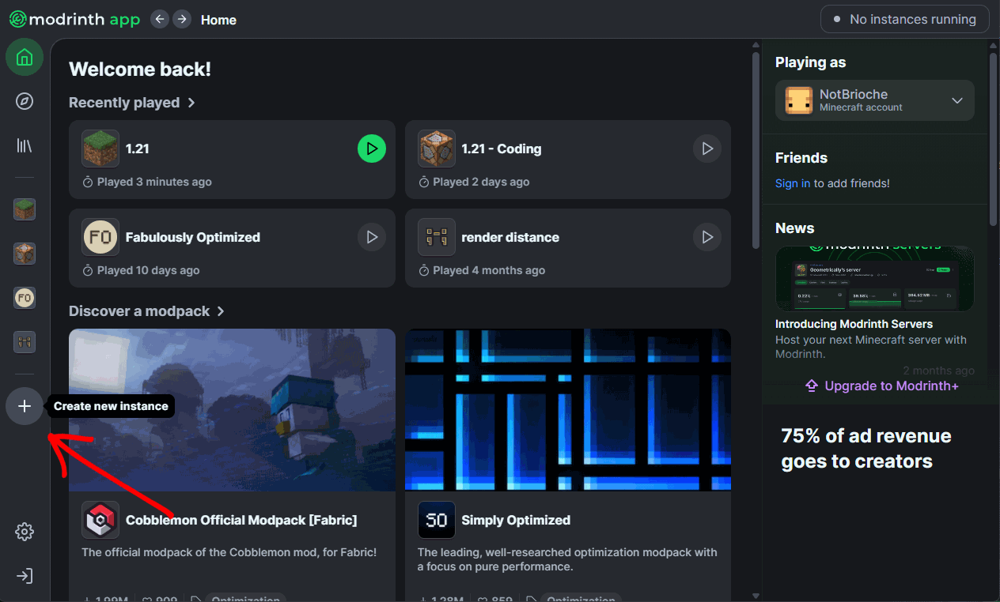

# Minecraft Modpacks

# Introduction

Welcome to the repo ! This project is designed to share my modpacks I'm using for datapack and plugin development with explanations how to customize them and why I use these mods.

# Features

I made 4 modpack for players you to use, feel free to modify them as you need but it should be covering most use cases.
| Modpack               | Features                                       |
|-----------------------|------------------------------------------------|
| [Classic](#modpacks)  | Optimisations, Texture pack compatibility, PVP |
| [Datapack](#modpacks) | Build, Datapack creation, Online forwarding    |
| [Plugin](#modpacks)   | Lightweight, Network Optimisations             |
| [All](#modpacks)      | Contains all the mods from modpacks            |

If you want to see a list of all the mods for each modpack, there is a list [here](#).

## Compatibility

I'm using [Packwiz](https://github.com/packwiz/packwiz) to create the modpack files, to use them I recommand using [Modrinth](https://modrinth.com) but this is also compatible with [AtLauncher](https://atlauncher.com), [MultiMC](https://multimc.org) and [Prism Launcher](https://prismlauncher.org)

# Installation guide

First you need to install a modpack from [the list](#modpacks). Then click download row in the upper left corner

Create a new instance  

Then import the modpack with the file  

# Modpacks

| Version | Classic                                                | Datapack                                                 | Plugin      | All      | Mods list                       |
|---------|--------------------------------------------------------|----------------------------------------------------------|-------------|----------|---------------------------------|
| 1.21.1  | [Classic](modpacks/1.21.1/Classic%20-%201.21.1.mrpack) | [Datapack](modpacks/1.21.1/Datapack%20-%201.21.1.mrpack) | [Plugin](#) | [All](#) | [Mods](modpacks/1.21.1/list.md) |

# Customization

Some mods are present in every modpack like [Custom HUD](https://modrinth.com/mod/customhud), they offer a good experience with a great range for customization. Presets are made in the modpacks but you can change it anytime with [Mod Menu](https://modrinth.com/mod/modmenu). Here is a list for [Customizable Mods](modpacks/general.md#Customizable-mods)

# Updating mods

From what I know it is not possible to directy update a modpack for a new version on [Modrinth](https://modrinth.com), if you need to update versions you can use my modpacks. I will be updating frequently for newer versions with informations on the non-avalible mods. Once you.ve downloaded the modpack **do not update the mods**, it will surely break.

# Participating

If you have any suggestions for mods I could use in my modpack let me know, I will take time to respond with my opinion and maybe add it to the list.

# FAQ

Nothing here for now ✨
