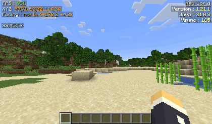
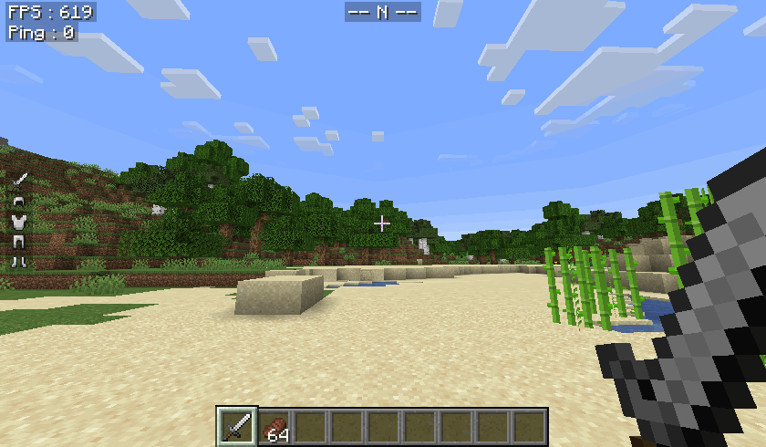
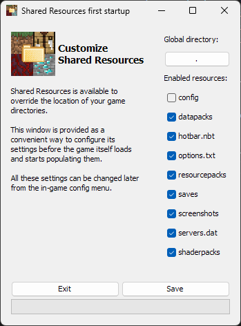

# Very useful mods

There is two mods I absolutely recommand for everybody, [Custom Hud](#) and [Shared ressources](#), if you dont know what they are doing, le me eplain it below.

# Custom HUD

This mod lets you create a HUD with a very high customization, here are some example all from the same mod.

The [documentation](https://customhud.dev/#docs) is here!

# Shared ressources

Shared ressources is a mad that allows you to change the location of somes folders used by the modpack

## Setup

This is the part you don't want to mess up, on the first launch the mod will show you this popup  

On the `global directory` option, I recommand to change it for the `.minecraft` base instalation location (default location is `C:\Users\Brioche\AppData\Roaming\.minecraft`). If you `Save` like with without changing anything your options, world, texturepacks, shaders and screenshots will be shared across every modpack.

Here is an explanation for every field in the parameters :
| Name             | Description                                             |
|------------------|---------------------------------------------------------|
| Global directory | The path the mod will use to redirect selected elements |
| config           | The configuration file of mods                          |
| datapacks        | The datapacks you can select while creating a new world |
| hotbar.nbt       | The saved hotbars in the creative inventory             |
| options.txt      | Options of you game (keybinds, gamma, etc.)             |
| resourcepacks    | The texture packs you can select in the options         |
| saves            | The singleplayers worlds                                |
| screenshots      | The folders where every screenshots are saved           |
| servers.dat      | The list of servers in the multiplayer menu             |
| shaderspacks     | List of shaders                                         |
